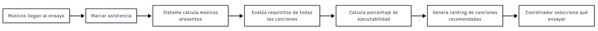

# Sistema de Gestión de Banda Musical - Visión General

## 🎵 Introducción

El **Sistema de Gestión de Banda Musical** es una plataforma integral diseñada para facilitar la coordinación, organización y gestión de grupos musicales. El sistema permite a coordinadores y músicos gestionar eventos, ensayos, repertorio musical y participación de manera eficiente y colaborativa.

## 🎯 Objetivos del Sistema

### Objetivos Principales
- **Centralizar la gestión** de todos los aspectos relacionados con la banda musical
- **Facilitar la coordinación** entre músicos para eventos y ensayos
- **Optimizar la selección de repertorio** basándose en disponibilidad y habilidades
- **Mejorar la comunicación** y toma de decisiones grupales
- **Automatizar procesos** repetitivos y propensos a errores

### Beneficios Clave
- 📅 **Planificación eficiente** de eventos y ensayos
- 🎼 **Recomendaciones inteligentes** de canciones ejecutables
- 🗳️ **Procesos de votación** democráticos y transparentes
- 📊 **Visibilidad completa** del estado de preparación
- 🎪 **Gestión profesional** de presentaciones musicales

## 👥 Usuarios del Sistema

### 🎭 Coordinador
**Rol principal de gestión y organización**
- Crear y gestionar eventos musicales
- Programar ensayos y marcar asistencia
- Gestionar el catálogo de canciones
- Supervisar procesos de votación
- Generar reportes y estadísticas

### 🎸 Músico
**Participante activo de la banda**
- Confirmar disponibilidad para eventos
- Participar en votaciones de repertorio
- Ver recomendaciones personalizadas
- Actualizar perfil e instrumentos
- Consultar cronograma de ensayos

### 👨‍💼 Administrador
**Gestión técnica del sistema**
- Configurar parámetros del sistema
- Gestionar usuarios y permisos
- Mantener catálogos maestros
- Supervisar el estado del sistema
- Realizar respaldos y mantenimiento

## 🏗️ Arquitectura del Sistema

### Patrón de Microservicios

El sistema está construido siguiendo una **arquitectura de microservicios**, donde cada servicio tiene responsabilidades específicas y bien definidas:

```
┌─────────────────────────────────────────────────────────────┐
│                    Frontend Web/Mobile                     │
├─────────────────────────────────────────────────────────────┤
│                      API Gateway                           │
├─────────────────────────────────────────────────────────────┤
│  🎪 Events    🎵 Songs     🗳️ Voting   👥 Musicians        │
│  Service      Service     Service     Service              │
│                                                             │
│  📅 Availability  🎭 Rehearsals                           │
│  Service          Service                                   │
├─────────────────────────────────────────────────────────────┤
│              🗄️ PostgreSQL Database                       │
└─────────────────────────────────────────────────────────────┘
```

### Principios de Diseño

1. **Separación de Responsabilidades**: Cada servicio maneja un dominio específico
2. **Independencia de Datos**: Cada servicio tiene su propio esquema de base de datos
3. **Comunicación por API**: Interacción través de APIs REST bien definidas
4. **Escalabilidad Horizontal**: Servicios pueden escalarse independientemente
5. **Tolerancia a Fallos**: El sistema continúa funcionando aunque algunos servicios fallen

## 🧩 Componentes del Sistema

### 1. 🎪 Servicio de Eventos
**Núcleo del sistema - Gestión de eventos musicales**

**Responsabilidades:**
- Crear y gestionar eventos (conciertos, ensayos, grabaciones)
- Controlar participantes y confirmaciones
- Manejar estados del ciclo de vida de eventos
- Coordinar con otros servicios para funcionalidades complejas

**Entidades Principales:**
- `Evento`: Información básica del evento musical
- `ParticipanteEvento`: Músicos confirmados para cada evento
- `Catálogos`: Tipos de evento, estados, roles de participación

### 2. 🎵 Servicio de Canciones
**Gestión del repertorio musical**

**Responsabilidades:**
- Mantener catálogo de canciones disponibles
- Definir requisitos instrumentales por canción
- Asociar canciones seleccionadas a eventos específicos
- Evaluar viabilidad de ejecución según recursos disponibles

**Entidades Principales:**
- `Cancion`: Información de canciones (título, artista, dificultad)
- `RequisitoCancion`: Instrumentos/roles necesarios para cada canción
- `CancionEvento`: Canciones seleccionadas para eventos específicos

### 3. 🗳️ Servicio de Votación
**Sistema democrático de selección de repertorio**

**Responsabilidades:**
- Gestionar recomendaciones de canciones por evento
- Crear y administrar procesos de votación
- Registrar votos y calcular resultados
- Determinar canciones ganadoras automáticamente

**Entidades Principales:**
- `RecomendacionCancion`: Sugerencias de canciones para eventos
- `Votacion`: Procesos de votación activos
- `Voto`: Votos individuales de cada músico

### 4. 👥 Servicio de Músicos
**Gestión de perfiles y habilidades**

**Responsabilidades:**
- Mantener perfiles de músicos de la banda
- Registrar instrumentos y niveles de habilidad
- Gestionar estados de membresía (activo, inactivo)
- Proveer información para recomendaciones inteligentes

**Entidades Principales:**
- `Musico`: Información personal y de contacto
- `InstrumentoMusico`: Instrumentos que toca cada músico y su nivel

### 5. 📅 Servicio de Disponibilidad
**Control de disponibilidad y horarios**

**Responsabilidades:**
- Registrar disponibilidad general por evento
- Confirmar asistencia a ensayos específicos
- Mantener horarios regulares de práctica
- Facilitar planificación de actividades grupales

**Entidades Principales:**
- `DisponibilidadEvento`: Disponibilidad general para eventos
- `DisponibilidadEnsayo`: Confirmación específica para ensayos
- `HorarioPractica`: Horarios regulares disponibles

### 6. 🎭 Servicio de Ensayos
**Coordinación y optimización de ensayos**

**Responsabilidades:**
- Programar ensayos asociados a eventos
- Registrar asistencia en tiempo real
- **Funcionalidad Clave**: Calcular automáticamente qué canciones se pueden ensayar según músicos presentes
- Generar recomendaciones inteligentes de repertorio

**Entidades Principales:**
- `Ensayo`: Ensayos programados
- `AsistenciaEnsayo`: Registro de quién asistió
- `RecomendacionCancionEnsayo`: Canciones ejecutables según presentes

## 🔄 Flujos de Trabajo Principales

### 1. Organización de un Concierto


### 2. Proceso de Ensayo Inteligente




### 3. Ciclo de Vida de Votación


## 🔧 Tecnologías Utilizadas

### Backend
- **Python 3.11+**: Lenguaje principal
- **FastAPI**: Framework web moderno y eficiente
- **SQLAlchemy**: ORM para manejo de base de datos
- **Pydantic**: Validación de datos y serialización
- **PostgreSQL**: Base de datos relacional robusta

### Infraestructura
- **Docker**: Contenedorización de servicios
- **Docker Compose**: Orquestación local
- **Kubernetes**: Orquestación en producción (futuro)
- **Redis**: Caché y sesiones (futuro)
- **RabbitMQ**: Mensajería asíncrona (futuro)

### Desarrollo y Operaciones
- **Git**: Control de versiones
- **GitHub Actions**: CI/CD (futuro)
- **Prometheus**: Monitoreo (futuro)
- **Grafana**: Dashboards (futuro)

## 📊 Funcionalidades Destacadas

### 🎯 Recomendación Inteligente de Canciones

**Algoritmo de Ejecutabilidad:**
```python
puntaje_ejecutabilidad = (músicos_presentes_requeridos / total_músicos_requeridos) * 100
```

**Criterios de Recomendación:**
- Instrumentos disponibles vs requeridos
- Nivel de habilidad de músicos presentes
- Dificultad de la canción
- Historial de ejecución exitosa

### 🗳️ Sistema de Votación Democrático

**Características:**
- Votación por ranking (1er lugar, 2do lugar, etc.)
- Cierre automático de votación por fecha
- Cálculo automático de ganadores
- Transparencia total en resultados

### 📊 Dashboard de Coordinador

**Métricas Clave:**
- Estado de preparación por evento
- Porcentaje de confirmaciones
- Progreso de ensayos
- Estadísticas de participación

## 🔒 Seguridad y Permisos

### Autenticación
- **JWT Tokens**: Para sesiones seguras
- **Refresh Tokens**: Para renovación automática
- **Password Hashing**: Usando bcrypt

### Autorización por Roles

| Funcionalidad | Coordinador | Músico | Admin |
|---------------|-------------|--------|-------|
| Crear eventos | ✅ | ❌ | ✅ |
| Invitar músicos | ✅ | ❌ | ✅ |
| Votar canciones | ✅ | ✅ | ✅ |
| Marcar asistencia | ✅ | ❌ | ✅ |
| Ver reportes | ✅ | 📊 | ✅ |
| Configurar sistema | ❌ | ❌ | ✅ |

## 📈 Métricas y KPIs

### Operacionales
- **Tiempo de respuesta** de APIs < 200ms
- **Disponibilidad** del sistema > 99.5%
- **Precisión** de recomendaciones > 85%

### De Negocio
- **Participación** en votaciones > 70%
- **Asistencia** a ensayos promedio
- **Satisfacción** de usuarios
- **Eventos** completados exitosamente

## 🚀 Roadmap y Evolución

### Fase 1: MVP (Actual)
- ✅ Gestión básica de eventos
- ✅ Sistema de recomendaciones
- ✅ Votación simple
- ✅ Registro de asistencia

### Fase 2: Optimización
- 🔄 Notificaciones push
- 🔄 Integración con calendarios
- 🔄 Reportes avanzados
- 🔄 API móvil

### Fase 3: Inteligencia
- 📅 Machine Learning para recomendaciones
- 📅 Análisis predictivo de asistencia
- 📅 Optimización automática de horarios
- 📅 Integración con servicios de música

## 🎉 Conclusión

El Sistema de Gestión de Banda Musical representa una solución moderna y escalable para los desafíos comunes de coordinación musical. Mediante el uso de tecnologías actuales y patrones de diseño robustos, el sistema facilita la gestión eficiente de bandas musicales mientras proporciona una experiencia de usuario intuitiva y funcionalidades inteligentes.

La arquitectura de microservicios permite evolución continua y escalabilidad, asegurando que el sistema pueda crecer junto con las necesidades de la banda y adaptarse a nuevos requerimientos del mundo musical digital.